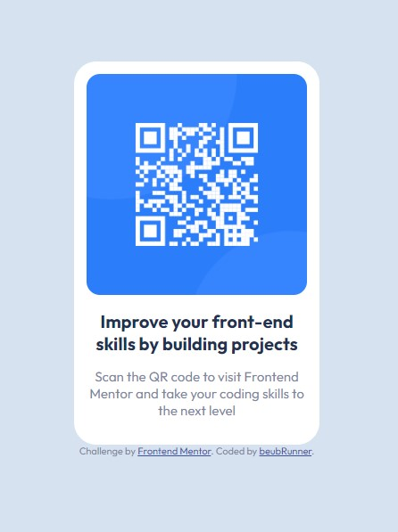

# Frontend Mentor - QR code component solution

This is a solution to the [QR code component challenge on Frontend Mentor](https://www.frontendmentor.io/challenges/qr-code-component-iux_sIO_H). Frontend Mentor challenges help you improve your coding skills by building realistic projects. 

## Table of contents

- [Overview](#overview)
  - [Screenshot](#screenshot)
  - [Links](#links)
- [My process](#my-process)
  - [Built with](#built-with)
  - [What I learned](#what-i-learned)
  - [Useful resources](#useful-resources)
- [Author](#author)
- [Acknowledgments](#acknowledgments)

## Overview

### Screenshot

### Links

- Solution URL: [Add solution URL here](https://github.com/BeubRunner/FrontendMentor-qrCodeComponent.git)
- Live Site URL: [Add live site URL here](https://beubrunner.github.io/FrontendMentor-qrCodeComponent/)

## My process

### Built with

- Semantic HTML5 markup
- CSS custom properties
- Flexbox

### What I learned

To see how to nested some flexbox in order to vertically center some content.

To use google font import from the API, by link into the html head or by @import into the stylesheet. 
This last solution solved the CORS error issue I encountered on my first code.

### Useful resources

- [CORS error documentation](https://developer.mozilla.org/en/docs/Web/HTTP/CORS/Errors) - This helped me to uderstand what was going wrong in my first code

## Author

- Frontend Mentor - [@yourusername](https://www.frontendmentor.io/profile/yourusername)

## Acknowledgments

Lars @htmlars for his feedback about google font imports